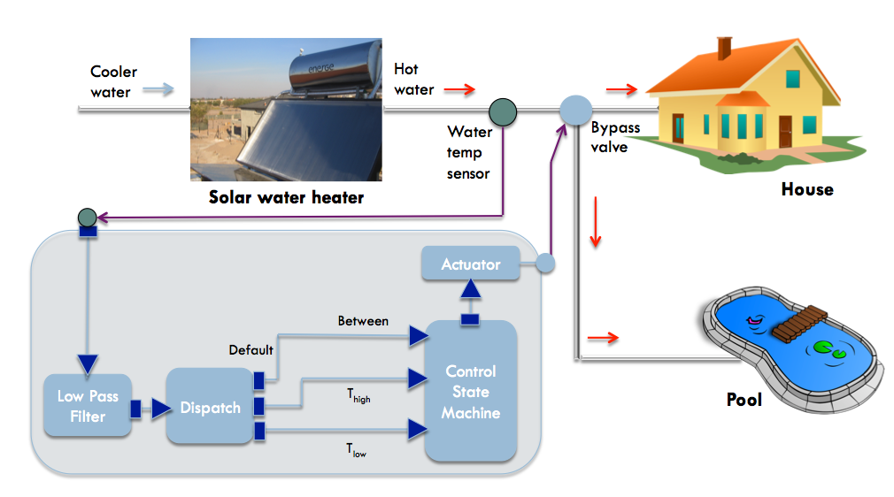
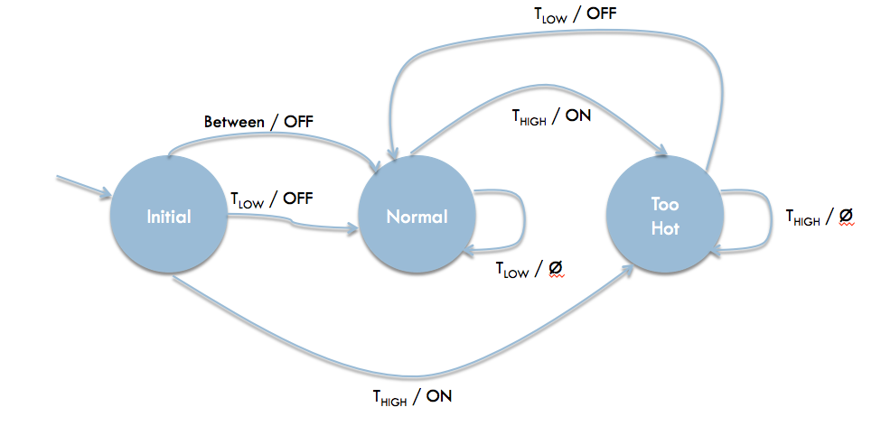

.. _more-examples:

6. More Examples
================
This section contains more examples of ThingFlow in action. The code for these
examples may be found in the ``examples`` subdirectory of the ``thingflow-python``
repository.

.. _solar-water-heater:

Solar Water Heater
------------------
In this scenario, we have a solar water heater that provides hot water for a
residence. There is a water temperature
sensor on the output pipe of the heater. There is also an actuator which
controls a bypass valve: if the actuator is ON, the hot water is redirected to a
spa, instead of going to the house. The spa is acting as a heat sink, taking
up the extra heat, so that the water in the house never gets too hot.

We will implement a state machine which looks at the data
from the temperature sensor and turns on the bypass valve when the heated water
is too hot. To avoid oscillations, we use the following logic:

1. If the running average of the temperature exceeds T_high, turn on the bypass
2. When the running average dips below T_low (where T_low<T_high), then turn
   off the bypass.

Here is a diagram of the ThingFlow flow which implements this application:

We see that the water sensor's output is run through a low pass filter to
reduce noise in the reading. It is then passed to a dispatcher 1[#]_
which sends each event to one of several output ports, depending on how it compares
to T_low and T_high. The control state machine determines when to turn on
the actuator, based on the current state and the port of the input event.

Here is the ThingFlow code connecting everything together:

.. code-block:: python
		
    T_high = 110 # Upper threshold (degrees fahrenheit)
    T_low = 90 # Lower threshold
    sensor = TempSensor(gpio_port=1)
    
    # The dispatcher converts a sensor reading into
    # threshold events
    dispatcher = sensor.transduce(RunningAvg(5)) \
                       .dispatch([(lambda v: v[2]>=T_high, 't_high'),
                                  (lambda v: v[2]<=T_low, 't_low')])
    controller = Controller()
    dispatcher.connect(controller, port_mapping=('t_high','t_high'))
    dispatcher.connect(controller, port_mapping=('t_low', 't_low'))
    dispatcher.connect(controller, port_mapping=('default', 'between'))
    
    actuator = Actuator()
    controller.connect(actuator)

Here is a the state machine to be implemented by the ``Controller`` class:

We start in the state ``Initial``. If the first incoming event is ``T_high``,
we go to the ``Normal`` state. Othewise, we immediately go to ``Too Hot``, which
will turn off the actuator. After the initial event, we move from ``Normal`` to
``Too Hot`` if we receive a ``T_high`` event and then back to ``Normal`` when we
receive ``T_low``. Here is the code which implements this state machine as a
ThingFlow filter:

.. code-block:: python

    class Controller(OutputThing):
        def __init__(self):
            super().__init__()
            self.state = INITIAL
            self.completed = False
    
        def _make_event(self, val):
            return SensorEvent(ts=time.time(), sensor_id='Controller', val=val)
        
        def on_t_high_next(self, event):
            if self.state==NORMAL or self.state==INITIAL:
                self._dispatch_next(self._make_event("ON"))
                self.state = TOO_HOT    
        def on_t_high_completed(self):
            if not self.completed:
                self._dispatch_completed()
                self.completed = True
        def on_t_high_error(self, e):
            pass
    
        def on_t_low_next(self, event):
            if self.state==TOO_HOT or self.state==INITIAL:
                self._dispatch_next(self._make_event("OFF"))
                self.state = NORMAL
        def on_t_low_completed(self):
            if not self.completed:
                self._dispatch_completed()
                self.completed = True
        def on_t_low_error(self, e):
            pass
                
        def on_between_next(self, x):
            if self.state==INITIAL:
                self.state = NORMAL
                self._dispatch_next(self._make_event("OFF"))
            else:
                pass # stay in current state
        def on_between_error(self, e):
            pass
        def on_between_completed(self):
            # don't want to pass this forward,
	    # as it will happen after the first item
	    pass
    
As you can see, we have ``on_next``, ``on_completed``, and ``on_error`` methods
for each of the three input ports. A nice property of this design is that the
state machine logic is isolated to a single class and does not ever deal with
actual sensor readings. This makes it easy to test to test the controller logic
independent of the physical sensor and actuator.

The full code for this example may be found at ``examples/solar_heater_scenario.py``.

.. [#] ``thingflow.filters.dispatch.Dispatcher``

GE Predix Adapters
------------------
GE Digital's `Predix <https://predix.io>`_ platform is a public cloud service
optimized for building IoT data analyses and applications. The
`Time Series Service <https://docs.predix.io/en-US/content/service/data_management/time_series/>`_
supports the storage and retrieval of cloud sensor event data. ThingFlow events map
very naturally to this service, and adapters are provided in the
``thingflow.adapters.predix`` module. This allows us to build ThingFlow
applications that run "on the edge" and upload their event data to Predix for
analysis.

Initial Configuration
~~~~~~~~~~~~~~~~~~~~~
Before using the Predix adapters, you will need to configure on Predix a UAA
(User Authentication and Authorization) service and a Timeseries service. You will
also need to install some client side CLI appliations to query and update Predix
configurations. Instructions and hints on this may be found in a separate Github
repository: https://github.com/jfischer/ge-predix-python-timeseries-example.

PredixWriter
~~~~~~~~~~~~
The ``PredixWriter`` class is an ``InputThing`` which accepts ThingFlow events
and sends them to the Predix Time Series Service via a websocket API. Here
is some example code which instantiates a writer, connects it to a sensor and
runs the resulting flow:

.. code-block:: python

    # The next three values are specific to your install
    INGEST_URL = ...
    PREDIX_ZONE_ID = ...
    TOKEN = ...
    # The data comes from a light sensor
    sensor1 = SensorAsOutputThing(LuxSensor('test-sensor1'))
    writer = PredixWriter(INGEST_URL, PREDIX_ZONE_ID, TOKEN,
                          batch_size=3)
    sensor1.connect(writer)
    scheduler = Scheduler(asyncio.get_event_loop())
    scheduler.schedule_periodic(sensor1, 0.5)
    scheduler.run_forever()
		
The ``INGEST_URL``, ``PREDIX_ZONE_ID``, and ``TOKEN`` parameters
are described in the example repository's
`README <https://github.com/jfischer/ge-predix-python-timeseries-example/blob/master/README.rst>`_ file.
The ``batch_size`` parameter indicates how many events to buffer in memory before
sending them up within a single message. 

By default, ``PredixWriter`` expects to receive instances of ``SensorEvent``,
which each include a Unix timestamp (in seconds as is the Python convention),
a sensor id, and a value. If you want to sent data using a different representation
in ThingFlow, you can subclass from ``EventExtractor``, which defines how to
obtain the Predix event fields from an incoming ThingFlow event. This extractor
is then passed as an ``extractor`` keyword parameter to the ``PredixWriter``
constructor. Note that Predix timestamps are expressed in milliseconds rather
than seconds.

PredixReader
~~~~~~~~~~~~
The ``PredixReader`` class queries the Predix Time Series service for
events from a specified sensor over a specified time range. These are then
mapped to events in the ThingFlow world and passed to any connected things.
Here is a short example which instantiates a ``PredixReader`` to query
for events in the last minute, connects it ``print``, schedules the reader
to be run once every 60 seconds, and starts the flow.

.. code-block:: python

    # The next three values are specific to your install
    QUERY_URL = ...
    PREDIX_ZONE_ID = ...
    TOKEN = ...
    reader = PredixReader(QUERY_URL, PREDIX_ZONE_ID, TOKEN,
                          'test-sensor1', start_time=time.time()-3600,
			  one_shot=False)
    reader.connect(print)
    scheduler.schedule_periodic(reader, 60)
    scheduler.run_forever()
		
As with the writer, you must pass in a Query URL, Predix Zone Id,
and bearer token as determined through your Predix configuration.
The ``start_time`` parameter is the starting timestamp for the query.
By specifying ``one_shot`` as ``False``, we are requesting that the
reader be run until the process is killed. If ``one_shot`` was
set to ``True``, the reader will close its event stream after one
query.

If you want the reader to emit a different type of event, pass in a value for the
``build_event_fn`` keyword parameter of the ``PredixReader`` constructor.
The function should take as arguments
the sensor id, the predix timestamp (in milliseconds), the sensor value,
and a quality code (which is dropped in the default implementation). The
function should return a corresponding event for use in ThingFlow.

A complete version of this example may be found at ``examples/predix_example.py``.
This script can be executed from the command line.
